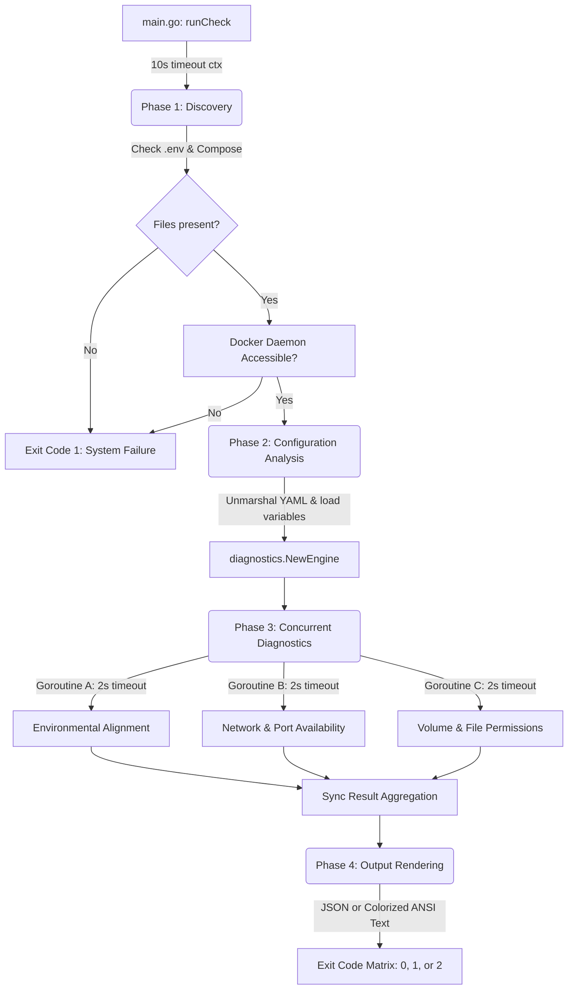

# halo

**halo** is a lightweight, blazing-fast CLI tool built to eliminate developer onboarding friction. It analyzes local `.env` and `docker-compose.yml` configurations to instantly verify container health, network connectivity, and file permissions—surfacing actionable fixes for broken local development environments in milliseconds.

Instead of wasting engineering hours debugging mismatched environment configurations, locked storage volumes, or port collisions, running `halo` gives developers a definitive, production-grade diagnostic health check of their workspace.

---

## Key Features

* **Zero Guesswork Diagnostics:** Validates local system state against declared Docker topologies.
* **Environment Drift Detection:** Cross-references `.env` variables directly with active compose declarations to flag missing keys. Compares `.env` against `.env.example` to detect missing or undeclared keys, validating alignment and service-level mounts.
* **Permission & Volume Auditing:** Inspects host-mounted paths, service secrets, and config declarations to catch permission issues, featuring native Unix `chmod` and Windows `icacls` auto-fixes.
* **Conflicting Process Identification:** Resolves and displays the exact PIDs and process names of host applications causing port collisions.
* **Sensitive Data Redaction:** Automatically filters and redacts sensitive environment variables containing keys like `SECRET`, `PASSWORD`, or `TOKEN` from the rendered output.
* **Offline Graceful Degradation:** Downgrades network reachability checks to warnings when the Docker daemon is unreachable, allowing local alignment and permissions checks to complete.
* **High-Performance Engine:** Built in Go using concurrent diagnostics, running full health checks in milliseconds.
* **Automation Ready:** Supports semantic exit codes, structured JSON output, and interactive/quiet execution flags to easily integrate into local git hooks or setup scripts.

---

## Architectural Lifecycle & Execution Flow

`halo` operates as a single, decoupled binary that safely evaluates your system state without side effects:



---

## Installation

Download and install the latest release via Go:

```bash
go install github.com/marcelo-lipienski/halo@latest
```

> **Note:** halo requires Go 1.26 or later.

---

## Commands

### `halo init`

Merges keys from `.env.example` into `.env`.
If `.env` does not exist, it copies `.env.example` verbatim, preserving comments and blank lines. If `.env` already exists, it only adds missing keys without overwriting your existing values. It automatically flags missing keys that require values before you run your application.

```bash
halo init
```

### `halo check`

Runs the full diagnostic suite and exits. This is the default command — running `halo` without a subcommand is equivalent to `halo check`.

```bash
halo check
```

### `halo version`

Prints the binary version, build commit SHA, and Go runtime details.

```bash
halo version
# halo version 0.1.0-beta.1 (abc1234)
# Go runtime:  go1.26.0 (linux/amd64)
```

---

## Flags & Options

All flags are global and work with both the root command and `halo check`.

### `--config-dir, -c`

Sets the root directory where `halo` will auto-discover configuration files (`.env`, `docker-compose.yml`, `docker-compose.override.yml`). Defaults to the current working directory (`.`).

```bash
# Run diagnostics against a project in another directory
halo check --config-dir /path/to/my-project

# Short form
halo check -c /path/to/my-project
```

> When `--config-dir` is set and no explicit `--env-file` or `--compose-file` flags are provided, halo will look for `.env` and `docker-compose.yml` (or `.yaml`) inside that directory.

---

### `--env-file, -e`

Specifies an explicit path to the `.env` file, overriding the auto-discovery path derived from `--config-dir`.

```bash
# Use a custom .env path
halo check --env-file /secrets/.env.production

# Short form
halo check -e .env.local
```

---

### `--compose-file`

Specifies one or more explicit `docker-compose` files to load. This flag can be repeated to load multiple files. When this flag is provided, automatic file discovery (including `docker-compose.override.*`) is **disabled**.

```bash
# Single explicit file
halo check --compose-file ./docker-compose.yml

# Multiple files — loaded and merged left-to-right
halo check \
  --compose-file docker-compose.yml \
  --compose-file docker-compose.override.yml \
  --compose-file docker-compose.local.yml
```

#### Multi-File Precedence & Merge Rules

When multiple files are provided, `halo` merges them **left-to-right**, where each subsequent file overrides or extends the previous one. This mirrors [Docker Compose's own merge and override rules](https://docs.docker.com/compose/how-tos/multiple-compose-files/merge/).

The merge strategy per field is:

| Field | Behaviour |
|---|---|
| `image`, `container_name`, `entrypoint`, `command` | **Override** — latter value replaces former if non-empty |
| `environment` | **Merge** — latter keys override former keys; new keys are appended |
| `ports` | **Append** — all port entries from all files are combined |
| `volumes` | **Override by target path** — if a latter file defines a volume with the same container target path, it replaces the former entry. Anonymous volumes (no target path) are always appended |
| `secrets`, `configs`, root-level `volumes` | **Override** — latter definition replaces former by name |

**Example:** given these two files:

```yaml
# docker-compose.yml
services:
  app:
    image: myapp:latest
    environment:
      - DB_HOST=localhost
    ports:
      - "8080:80"
    volumes:
      - ./data:/app/data
```

```yaml
# docker-compose.override.yml
services:
  app:
    image: myapp:dev
    environment:
      - DB_HOST=db
      - DEBUG=true
    ports:
      - "9229:9229"
    volumes:
      - ./data-dev:/app/data
```

After merging, the effective configuration is:

```yaml
services:
  app:
    image: myapp:dev           # overridden by latter file
    environment:
      DB_HOST: db              # overridden
      DEBUG: "true"            # appended
    ports:
      - "8080:80"              # kept
      - "9229:9229"            # appended
    volumes:
      - ./data-dev:/app/data   # overrode former /app/data mount
```

---

### `--format, -f`

Controls the output format. Accepts `text` (default) or `json`.

**Text format** (default) — renders a human-readable, ANSI-coloured checklist. ANSI colours are automatically suppressed when the output is piped or when the `NO_COLOR` environment variable is set.

```bash
halo check --format text
# === halo Diagnostics Report ===
# Status:   healthy
# Duration: 42ms
#
# [Environmental Alignment]
#   ✓ Variables Check
#   ✓ Mismatched Types Check
#
# [Network & Port Availability]
#   ✓ Port 8080 availability
#
# [Volume & File Permissions]
#   ✓ ./data read access
#   ✓ ./data write access
#
# 5 of 5 checks passed.
```

**JSON format** — emits a single-line minified JSON payload to `stdout`. Ideal for parsing in scripts, git hooks, or CI setup steps.

```bash
halo check --format json
# {"status":"healthy","duration_ms":38,"checks":[{"group":"Environmental Alignment","name":"Variables Check","status":"passed"},{"group":"Network & Port Availability","name":"Port 8080 availability","status":"passed"},{"group":"Volume & File Permissions","name":"./data read access","status":"passed"}]}

# Short form
halo check -f json

# Pipe to jq for readable inspection
halo check -f json | jq .
```

---

### `--verbose, -v`

Enables debug logging. In text mode, warnings will include their detailed error string alongside the actionable fix. Failures always show their error detail regardless of this flag.

```bash
halo check --verbose

# Short form
halo check -v
```

> With `--verbose`, warning-level check entries will print their raw system error details, useful for diagnosing partial failures such as an empty but defined environment variable.

---

### `--fix`

Automatically attempts to mitigate detected volume and permission failures. Specifically, `--fix` will:

* **Create missing directories** that are declared as bind-mount sources in `docker-compose.yml`.
* **Fix file permissions** on host-mounted paths where the current user lacks read/write access.

```bash
halo check --fix
```

> `--fix` applies only to **volume and permission** failures. It will not modify your `.env`, `docker-compose.yml`, or any running container state.

---

### `--interactive, -i`

Enables interactive mode. When a failure is detected, `halo` will prompt you for confirmation before executing any auto-fix mitigations on the host filesystem.

```bash
halo check --fix --interactive
```

---

### `--watch, -w`

Enables real-time file watching. `halo` monitors configuration files, custom env files, and docker-compose configurations. When a change or deletion is detected, it clears the terminal and instantly re-runs the diagnostics suite.

```bash
halo --watch
```

---

## Auto-Discovery Behaviour

When neither `--compose-file` nor `--env-file` flags are specified, `halo` automatically discovers configuration files from `--config-dir` (`.` by default):

1. **Primary compose file**: prefers `docker-compose.yml` over `docker-compose.yaml` (matching [Docker Compose's own file precedence](https://docs.docker.com/compose/how-tos/multiple-compose-files/merge/)).
2. **Override file**: if a `docker-compose.override.yml` (or `.yaml`) exists in the same directory, it is automatically loaded and merged on top of the primary file — exactly as Docker Compose itself would.
3. **`.env` file**: resolved from `<config-dir>/.env`.

---

## Exit Codes

`halo` returns standard semantic exit codes to safely embed into local developer automation workflows:

| Code | Condition | Meaning |
|---|---|---|
| `0` | **Healthy** | All configurations parsed and all diagnostic checks passed. |
| `1` | **System Failure** | Configuration files are missing, flags are invalid, or the local Docker daemon is unreachable. |
| `2` | **Environment Broken** | Configurations parsed successfully, but one or more localized development infrastructure checks failed. |

```bash
halo check
echo "Exit code: $?"
```

Use in a shell script:

```bash
if ! halo check -f json > /dev/null 2>&1; then
  echo "Environment is not healthy. Run 'halo check' for details."
  exit 1
fi
```

---

## Known Limitations

### Port Bypass Self-Exclusion

When auditing port collisions, `halo` automatically excludes ports that are bound by the service's own active containers to prevent false-positive reports. This self-exclusion mechanism relies on standard Docker Compose labels (`com.docker.compose.project` and `com.docker.compose.service`). 

If you are running standalone containers mapped to the same host ports without using Docker Compose (e.g., via manual `docker run` commands), they will lack these metadata labels. Consequently, their bound ports will always be flagged as port collisions by `halo`.

---

## Development & Guidelines

This project enforces strict **Test-Driven Development (TDD)** and leverages modern Go ^1.26 concurrency primitives and error handling patterns.

* Detailed architectural definitions can be found in `SPECIFICATION.md`.
* Automated agent workspace limits and style configurations are detailed in `AI_GUIDELINES.md`.
* Contribution guidelines are in `CONTRIBUTING.md`.
